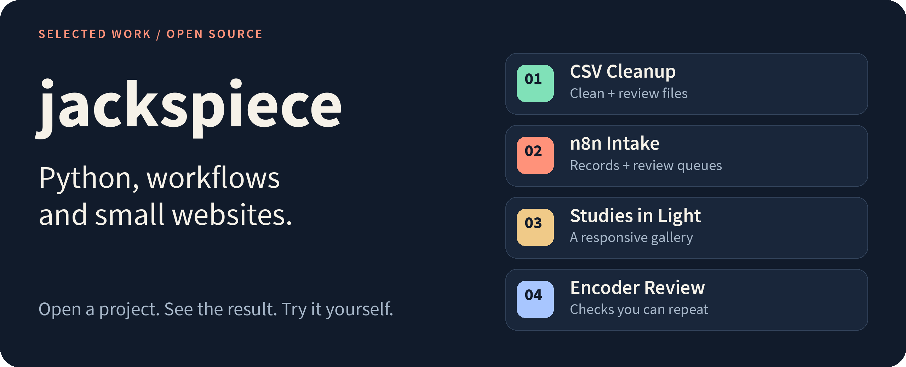

<picture>
  <source media="(max-width: 600px)" srcset="assets/header-mobile.png">
  
</picture>

I build small automations, data tools and web interfaces. These projects have something you can try, source you can inspect, and notes that explain what the result means.

**[Explore the projects](#selected-work)** · [Small project enquiries](https://ugig.net/u/jackspiece) · [Upstream contributions](docs/contributions.md)

## Selected work

### 01 · CSV Cleanup

Turn a CSV export into cleaned data, review rows and a change report. IDs stay text, and trimming and exact deduplication are optional.

**[See the example report →](https://jackspiece.github.io/csv-cleanup-example/)** · [Code and quick start](https://github.com/jackspiece/csv-cleanup-example)

### 02 · n8n Intake

An importable seven-node workflow with original records, review queues and a reconciliation count. The fictional example accounts for all eight inputs.

**[View the workflow →](https://github.com/jackspiece/n8n-intake-example)** · [Recorded n8n execution](https://github.com/jackspiece/n8n-intake-example/actions/runs/34645429890)

### 03 · Studies in Light

A responsive gallery built with HTML, CSS and JavaScript. Four public domain Monet paintings, readable captions and an enlarged image view.

**[Open the gallery →](https://jackspiece.github.io/gallery-layout-example/)** · [Source and layout notes](https://github.com/jackspiece/gallery-layout-example)

### 04 · Encoder Review

One published encoder checked against an independent reference. Includes the checker tests, exact source fingerprint and a recorded run of 65,976 cases.

**[Read the review →](https://github.com/jackspiece/encoder-review-example)** · [Saved result](https://github.com/jackspiece/encoder-review-example/blob/main/results/2026-09-11.json)

These four are independent work samples, using fictional data or credited public domain artwork where applicable.

## More projects

- **[Maintainer Radar](https://github.com/jackspiece/maintainer-radar)** turns pull request metadata into a review plan. [Try the browser demo](https://jackspiece.github.io/maintainer-radar/).
- **[Flappy Fly](https://github.com/jackspiece/flappy-fly)** combines a playable browser arcade with an ongoing fly-connectome learning experiment. [Open the arcade](https://jackspiece.github.io/flappy-fly/).

## Have a small project?

I take focused CSV cleanup, Python, workflow and website layout jobs. A short brief and a redacted sample help establish the scope. We agree on price, delivery and funding before work starts.

**[Contact me on uGig](https://ugig.net/u/jackspiece)** or [open a project enquiry](https://github.com/jackspiece/csv-cleanup-example/issues/new?template=work-request.md). Keep private data and account details out of public GitHub issues.
